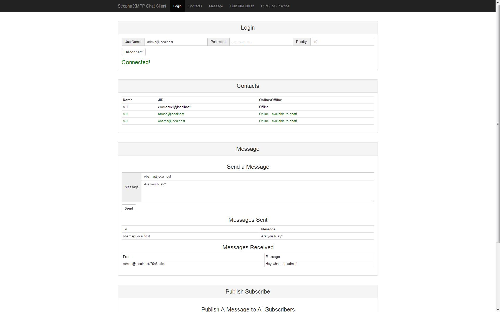

XMPP Web Client Using Strophe.js
=====================

Javascript Web XMPP Client...Works with Google Talk, Facebook Chat, and Openfire for a custom server.
I Used Nginx &amp; Punjab as well. The UI was built with help from [Twitter Bootstrap 3.0](http://getbootstrap.com/ "Twitter Bootstrap"). My implementation is Windows based, but should work on any OS.

###Example###
A demo hosted on github can be found here: [Chat Client](http://ramonrovirosa.github.io/ChatClient/ "XMPP Chat Client")

###Punjab###

To get the XMPP client running, first I installed Punjab, which requires python. 

For Punjab I used the version on github: https://github.com/twonds/punjab 

- Note: for Punjab, you need python, and version 2.7 worked for me, but not version 3.3..
- Install instructions can be found on the github page.
- Dependencies: twisted, pyopenssl. Both need to be added to the path environment.

###Nginx###

For nginx, I used the windows pre-configured version: http://www.kevinworthington.com/nginx-for-windows/
- Other versions directly from the nginx page did not work for me...

###Strophe###

Strophe JS Website: http://strophe.im/strophejs/

###XMPP Servers###

For Connecting to Google talk:
- User name: user@gmail.com
- Password: user google password

For Connecting to Facebook:
- User name: user@chat.facebook.com
- Password: user facebook password

#####You will most likely be required to authorize the client before use!#####

Openfire server: http://www.igniterealtime.org/projects/openfire/

###Durandal JS XMPP CLIENT###
Included is a folder, with an implementation for a SPA (Single Page Application) Durandal XMPP Client. Durandal website http://durandaljs.com/

##How to Run/Start the Client##
Once everything is installed:
  1. cd into your nginx root directory. 
  2. Run the cmd: twistd punjab.
  3. In a new terminal cd into your nginx directory again and run nginx.exe
  4. Open up http://localhost:80
  
  ####For the Durandal Client####
  1. Go to the directory containing the mimosa config file and run: <b>mimosa watch --server</b>
  2. Go to http://localhost:3000
